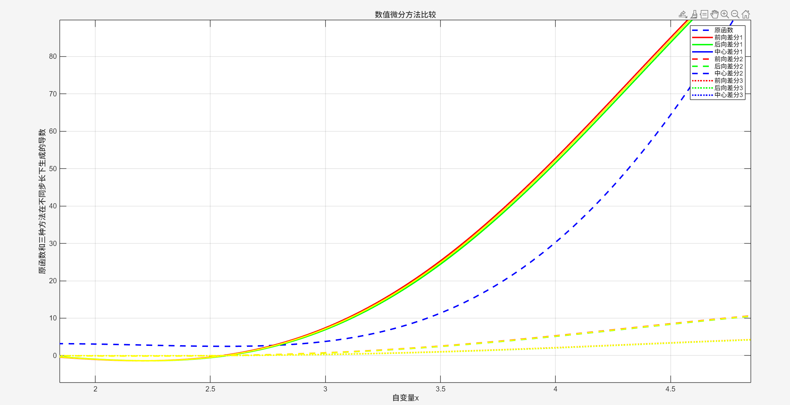
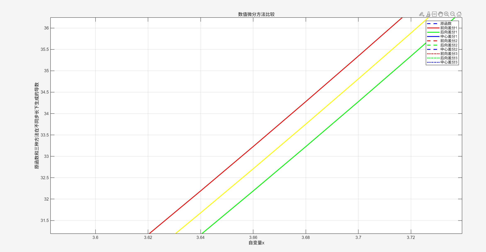
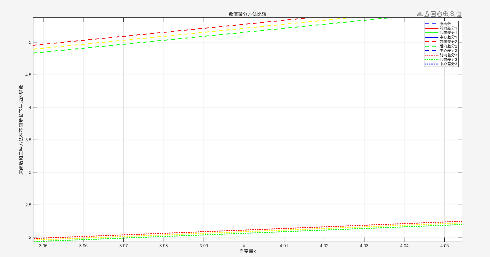
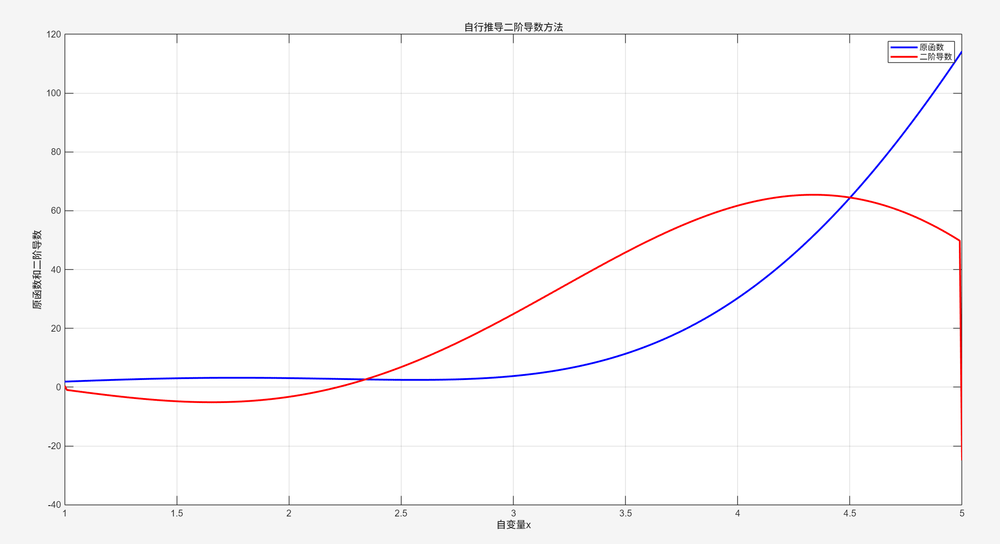

# Huazhong University of Science and Technology AUT5951
## Homework 2 - Foundations of Data Science
> 闫吕志
> 人工智能启明实验班2401

### Problem - Numerical Differentiation
#### Solution 1
In the first solution,I use the three different methods to calculate the differentiation of the function.Then I use the matlab to plot the origin function curve and the 9 curves of ouutcomes.The coding is below.
```matlab
dt1 = 0.02;
dt2 = 0.2;
dt3 = 0.5;

dt = dt1;

x = 1:dt:5;
y = 2*(x.^2).*cos(x) + 0.8*(x.^3);

plot(x,y,'b--','linewidth',2)
hold on; grid on;

n = length(x);
df_forward  = zeros(1,n);
df_backward = zeros(1,n);
df_central  = zeros(1,n);

% 前向差分（最后一点用后退差分代替）
df_forward(1:n-1) = (y(2:n) - y(1:n-1)) / dt;
df_forward(n) = (y(n) - y(n-1)) / dt;

% 后向差分（第一点用前向差分代替）
df_backward(2:n) = (y(2:n) - y(1:n-1)) / dt;
df_backward(1) = (y(2) - y(1)) / dt;

% 中心差分（边界用前/后代替）
df_central(2:n-1) = (y(3:n) - y(1:n-2)) / (2*dt);
df_central(1) = df_forward(1);
df_central(n) = df_backward(n);

plot(x,df_forward,'r','linewidth',2);
plot(x,df_backward,'g','linewidth',2);
plot(x,df_central,'y','linewidth',2);

hold on

dt = dt2;

% 前向差分（最后一点用后退差分代替）
df_forward(1:n-1) = (y(2:n) - y(1:n-1)) / dt;
df_forward(n) = (y(n) - y(n-1)) / dt;

% 后向差分（第一点用前向差分代替）
df_backward(2:n) = (y(2:n) - y(1:n-1)) / dt;
df_backward(1) = (y(2) - y(1)) / dt;

% 中心差分（边界用前/后代替）
df_central(2:n-1) = (y(3:n) - y(1:n-2)) / (2*dt);
df_central(1) = df_forward(1);
df_central(n) = df_backward(n);

plot(x,df_forward,'r--','linewidth',2);
plot(x,df_backward,'g--','linewidth',2);
plot(x,df_central,'y--','linewidth',2);

hold on

dt = dt3;

% 前向差分（最后一点用后退差分代替）
df_forward(1:n-1) = (y(2:n) - y(1:n-1)) / dt;
df_forward(n) = (y(n) - y(n-1)) / dt;

% 后向差分（第一点用前向差分代替）
df_backward(2:n) = (y(2:n) - y(1:n-1)) / dt;
df_backward(1) = (y(2) - y(1)) / dt;

% 中心差分（边界用前/后代替）
df_central(2:n-1) = (y(3:n) - y(1:n-2)) / (2*dt);
df_central(1) = df_forward(1);
df_central(n) = df_backward(n);

plot(x,df_forward,'r:','linewidth',2);
plot(x,df_backward,'g:','linewidth',2); 
plot(x,df_central,'y:','linewidth',2);

legend('原函数','前向差分1','后向差分1','中心差分1',...
'前向差分2','后向差分2','中心差分2',...
'前向差分3','后向差分3','中心差分3');
xlabel('自变量x');
ylabel('原函数和三种方法在不同步长下生成的导数');
title('数值微分方法比较');
```
And the curves are below:

As we can see,with the step size decreasing,the outcome will be more accurate,and the differences between three methods will be more visible.When step size is set 0.01,0.2 and 0.5 respectively,the differences are below in the plot:


#### Solution 2
Next,I am requested to design a method to calculate the derivative of the financial function gradient.Taylor series expansion is used to solve this.
As is known to all,
$f(t+\Delta t)=f(t)+\Delta t\frac{df}{dt}(t)
+\frac{(\Delta t)^2}{2!}\frac{d^2 f}{dt^2}(t)+o(\Delta t^2)$
$f(t-\Delta t)=f(t)-\Delta t \frac{df}{dt}(t)+\frac{(\Delta t)^2}{2!}\frac{d^2 f}{dt^2}(t)+o(\Delta t^2)$
Otherwise we can do this:
$f(t+\Delta t)+f(t-\Delta t)=2f(t)
+(\Delta t)^2\frac{d^2 f}{dt^2}(t)+o(\Delta t^2)$
Otherwise we can calculate $\frac{d^2 f}{dt^2}$:
$\frac{d^2 f}{dt^2}\approx \frac{f(t+\Delta t)+f(t-\Delta t)-2f(t)}{(\Delta t)^2}$
while the error is $O((\Delta x)^3)$
As to the computation at the first and last points,we can use $2\Delta t$ to solve the problem:
$\frac{d^2 f}{dt^2}\approx \frac{2f(t+\Delta t)-f(t+2\Delta t)-f(t)}{2(\Delta t)^2}$
or
$\frac{d^2 f}{dt^2}\approx \frac{2f(t-\Delta t)-f(t-2\Delta t)-f(t)}{2(\Delta t)^2}$
The coding is below:
```matlab
dt = 0.01;

x = 1:dt:5;
y = 2*(x.^2).*cos(x) + 0.8*(x.^3);

plot(x,y,'b','linewidth',2)
hold on; grid on;

n = length(x);
d2f = zeros(1,n);

% 二阶中心差分（边界用前向和后退差分代替）
d2f(2:n-1)=(y(3:n)+y(1:n-2)-2*y(2:n-1))/(dt^2);

% 首项
d2f(1)=(2*y(2)-y(3)-y(1))/(2*dt^2);
% 末项
d2f(n)=(2*y(n-1)-y(n-2)-y(n))/(2*dt^2);

% 绘图
plot(x,d2f,'r','linewidth',2);
legend('原函数','二阶导数');

xlabel('自变量x');
ylabel('原函数和二阶导数');
title('自行推导二阶导数方法');
```
The outcome is below:

As we can see,the errors at the computation at the first and last points are larger than the other.