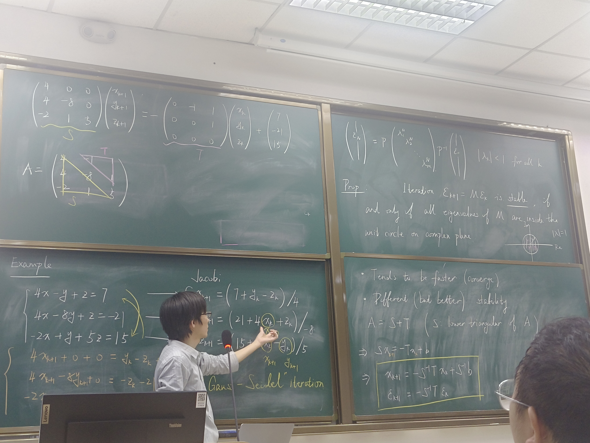

# Lecture 2 
## 解是否收敛？探究收敛的充分条件
* 精确解：$Dx=-Tx+b$
* 迭代解：$Dx_{k+1}=-Tx_k+b$

我们让两式相减，有误差迭代表示
$D(x-x_{k+1})=-T(x-x_k)$

记误差为$\epsilon$，有

$\epsilon_{k+1}=-D^{-1}T\epsilon_k$

> 线性代数补充：**Eigen-decomposition（特征值分解）**
> * 矩阵与向量相乘的本质是对向量作变换（**线性变换**）
> 由此可以知道：对于一个矩阵，特征向量就意味着这个向量只做了伸缩变换，而没有旋转变换，此时特征值为伸缩倍数
> 即：$Ax=\lambda x$,即**求解行列式方程$|A-\lambda I|=0$**
> * **特征值分解的步骤**：
>   * 根据行列式方程求出$\lambda$的所有可能解
>   * 对于每一个特征值，求出对应的特征向量（**注意特征向量并不唯一**）
> 在matlab中，可以用eig函数求出矩阵A的所有特征值：
> ```matlab
>A=[3,-1;-1,3];
>eig(A)
>```

对于误差递推，可以简记为$\epsilon_{k+1}=M\epsilon_k$；
引入上面提到的特征值分解，根据归纳可以得到$\epsilon_n = \lambda^n \epsilon_0$，此时只需$|\lambda|<1$就可以让结果（误差）收敛到$0$。

或者，引入矩阵相似对角化，迭代有$\epsilon_n = PA^n P^{-1} \epsilon_0$，此时若$A^n$在无穷时趋于零矩阵，即每个特征值都小于1，就可以让结果（误差）收敛到$0$。
所以只要**矩阵所有特征值的模小于1**（对应复平面落在单位圆内），那么迭代是有效的。
（关于矩阵是否可以相似对角化的条件在高等代数中有叙述）
> 取出矩阵的某一行：
> ```matlab
> A = [4,-1,-1;
> 4,-8,1;
> -2,1,5];
> A2 = [A1(3,:);A1(2,:);A1(1,:)];
> ```
> 取模函数：abs()

## Gauss-Seidel Iteration（高斯迭代）
* 思路：既然先计算出了$x_{k+1}$，那就可以用新的结果来参与剩下迭代的运算
* 优点：
  * 大多数情况下收敛更快（Tends to be faster）
  * 适用更多的矩阵
* 表示方法：$A=S+T$，其中$S$是下三角矩阵（lower trianger of A）

然后可以写出该迭代法的公式：
- $x_{k+1}=-S^{-1}Tx_k+S^{-1}b$
- $\epsilon_{k+1}=-S^{-1}T\epsilon_k$

（下三角矩阵是将$k+1$项全部移到左端后的系数矩阵结果） 

下面是实现高斯迭代的简单算法：
```matlab
A = [4,-1,1
4,-8,1;
-2,1,5];

b = [7;-21;15];

xsol = A\b;

%下三角矩阵
S = tril(A);
T=A - S;

x0=[2,2,1];
tol = 1e-6;
err=2*tol;

x(:,1)=x0;
index = 1;

while(err > tol) && (index < 100)
    x(:,index+1)=-S\T*x(:,index)+S\b;
    err=norm(x(:,index+1)-x(:,index),Inf);
    index=index+1;
end
disp(x(:,index))
```