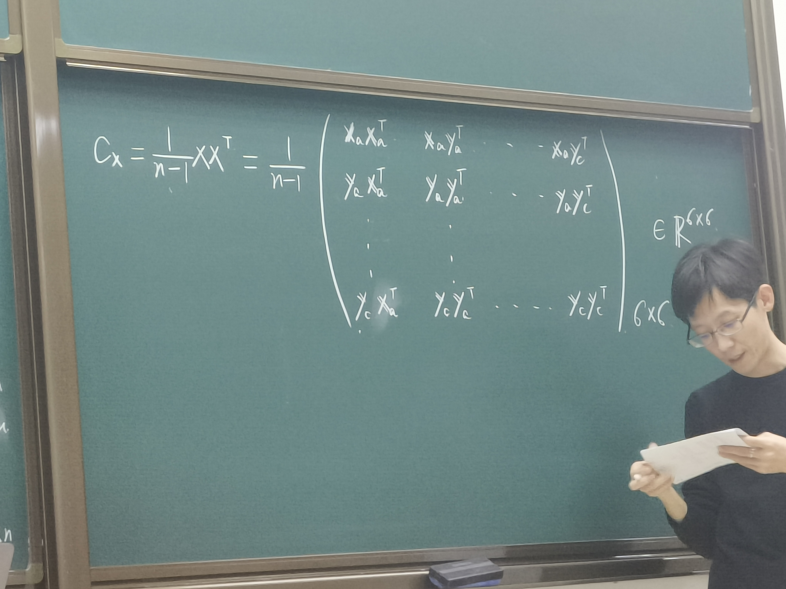
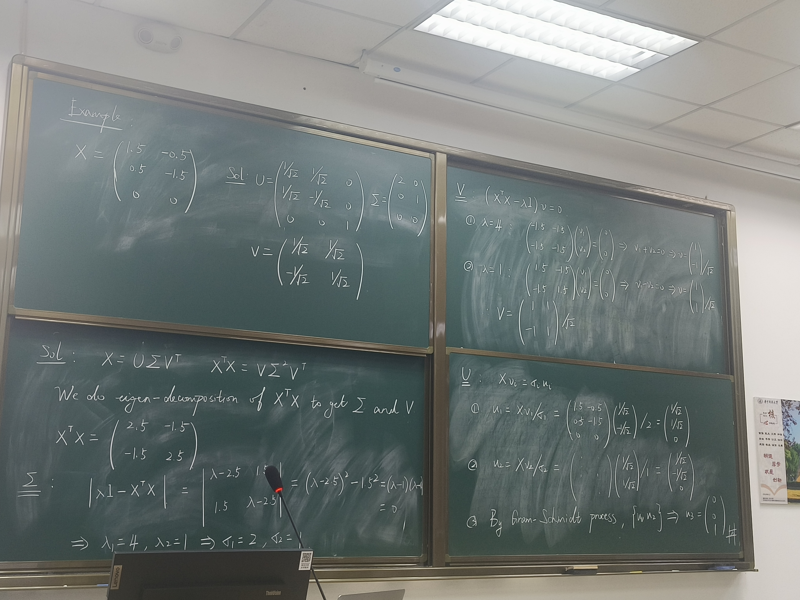
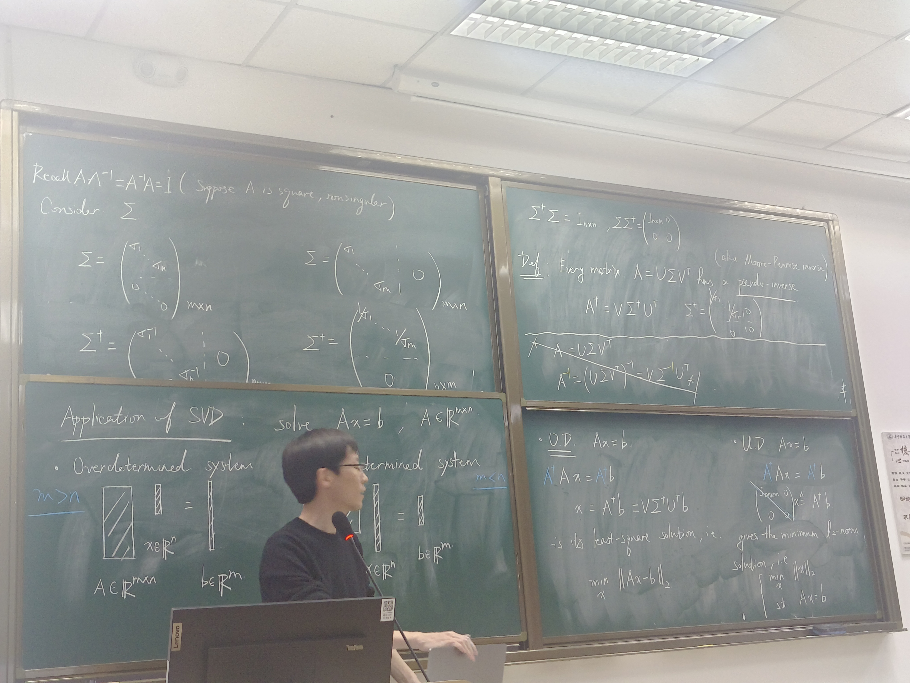

# Lecture 5
## Principal Component Analysis
Suppose that we use 3 cameras to measure the movement of m ,with $(x_a,y_a),(x_b,y_b),(x_c,y_c)$,
then$x=\begin{bmatrix} x_a&y_a&x_b&y_b&x_c&y_c\end{bmatrix}$,这是一个列向量。如果拍摄多个时间点，组合有$X=\begin{bmatrix}x_1&x_2&...&x_n\end{bmatrix}$，那么$X$就是$6*n$的一个矩阵。
**我们想要的是提取的物体运动方向上的一维向量。**
利用概率统计的知识，我们计算协方差$c_x=\frac{1}{n-1}XX^T$，得到协方差矩阵。

* $C_x$是一个方阵，而且是对称矩阵
* 对角线元素使每个分量和自己转置的乘积
* The off-diagonal terms of $C_x$ are the corariance between measurements.（如果值很大，说明有很多“信息重叠/冗余”）

- 期望：除对角之外为0，这样可以根据相关性大小选择角度
- 做法：Diagonalization（分解）:
    * By Eigen-decomosition（对角化分解）
    $C_x=XX^{T}=S\Sigma S^{T}$
    现在构造$Y=S^{T}X$，则有$C_Y=YY^{T}=(S^T X)(S^T X)^T = S^T(XX^T)S=S^T S\Sigma S^T S=\Sigma$
      * "principal components":the eigenvectors of $XX^T$
      * Iterpretation of P.C.:the j-th diagonal value of $C_Y$ is the variance of $X$ along $X_j$,the j-th column of $S$
    * By SVD（奇异值分解）
    $X=U\Sigma V^T$,令$Y=U^T X$，于是
    $C_Y=YY^T=(U^TX)(U^TX)^T=U^T(XX^T)U=U^T(U\Sigma V^TV\Sigma ^T)U=\Sigma\Sigma^T =\Sigma^2$

## Calculation of SVD（考）
### Example :
$X=\begin{bmatrix}1.5&-0.5\\0.5&-1.5\\0&0\end{bmatrix}$
奇异值分解结果：$U=\begin{bmatrix}\frac{1}{\sqrt{2}}&\frac{1}{\sqrt{2}}&0\\ \frac{1}{\sqrt{2}}&-\frac{1}{\sqrt{2}}&0\\0&0&1\end{bmatrix}$
$\Sigma=\begin{bmatrix}2&0\\0&1\\0&0\end{bmatrix}$
$V=\begin{bmatrix}\frac{1}{\sqrt{2}}&\frac{1}{\sqrt{2}}\\-\frac{1}{\sqrt{2}}&\frac{1}{\sqrt{2}}\end{bmatrix}$

#### Solution
$X=U\Sigma V^T$
$X^T X=V\Sigma^2 V^T$

故对$X^T X$作对角分解就可以得到$\Sigma$和$V$
在例子中，$X^T X=\begin{bmatrix}2.5&-1,5\\-1.5&2.5\end{bmatrix}$
$|\lambda I -X^T X|=|\begin{matrix}\lambda -2.5&1.5\\1.5&\lambda -2.5\end{matrix}|=(\lambda -2.5)^2-1.5^2 =(\lambda -1)(\lambda -4)=0$可得到$\Sigma$
解线性方程组$(XX^T-\lambda I)V=0$可以得到$V$
1. 当$\lambda=4$时，得到结果$v_1+v_2=0$，又$V$是单位正定矩阵，故有$v=[1,-1]/\sqrt{2}$
2. 当$\lambda=1$时，解得$v_1-v_2=0$，故$v=[1,1]/\sqrt{2}$
3. 故$V=\begin{bmatrix}1&1\\-1&1\end{bmatrix}/\sqrt{2}$

计算$U$用原始定义：$Xv_i=\sigma_i u_i$
1. $u_1=Xv_1/\sigma_1=[\frac{1}{\sqrt{2}},\frac{1}{\sqrt{2}},0]$
2. $u_2=Xv_2/\sigma_2=[\frac{1}{\sqrt{2}},-\frac{1}{\sqrt{2}},0]$
3. 用施密特正交化过程算出第三个正交向量，有$u_3=[0,0,1]$

## Application of SVD
### solve $Ax=b,A\in R^{m*n}$
* Overdetermined system($m>n$):方程个数大于未知数个数
* Underdetermined system($m<n$):未知数个数大于方程个数
* 模仿方阵逆的定义$AA^{-1}=I$，我们想要构造类似的东西
在奇异值分解结果的$\Sigma$下面加对角$0$构成$m*n$的矩阵，希望有类似的效果
对应的，有$\Sigma^\dagger$是对角$\sigma_n^{-1}$右边补$0$。
这样，有$\Sigma^\dagger \Sigma=I_{n*n},\Sigma\Sigma^\dagger=\begin{bmatrix}I_{n*n}&0\\0&0\end{bmatrix}$
于是，我们定义：
每个矩阵$A$的奇异值分解都有一个对应的**伪逆（pseudo-inverse）**，即
$A^\dagger=V\Sigma^\dagger U^T$

现在，我们用伪逆求方程组：
- 当$m>n$时，$x=A^\dagger b$，实际上是最小二乘解，或者说是下列**优化问题**的解：
$min_{x} ||Ax-b||_2$
- 当$m<n$时，上述解是所有解里面二范数最小的解，也是下列优化问题的解：
$min_{x} ||x||_2,s.t.Ax=b$
