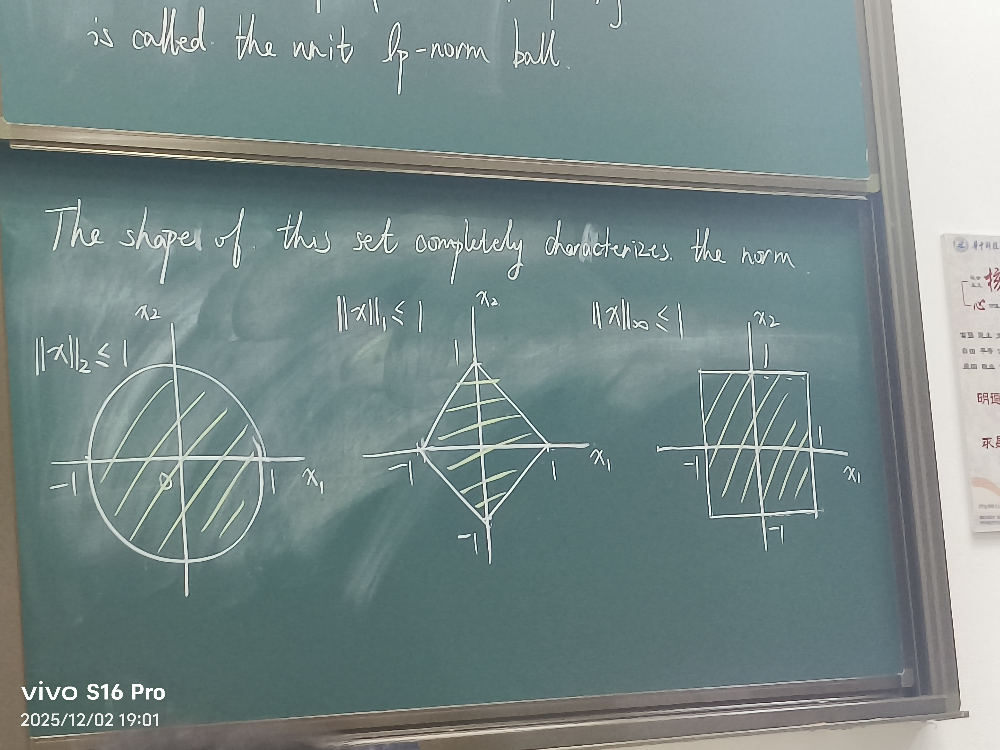

# Lecture 6
## Contents
* Sysrems of linear equations
* Matrix decomposition
* Matrix norms(optional)
* 数值计算
* 优化
## Vector and Matrix Norms
### Norms
#### Definition : 
A function $\|.\|$
* $\|x\|>0\,and\,\|x\|=0\,only\,x=0$
* $\|\alpha x\|=|\alpha| \|x\| \,for \,any$ 
* $\|x+y\|\leq \|x\|+\|y\|$
如果在n维空间中，则有
* **standard Enclidean length（欧几里得距离）**:$\|x\|_2={(\sum\limits_{i=1}^{n}{x_i}^2)}^{\frac{1}{2}}(l_2 norm)$
* **sum-of absolute -values length（曼哈顿距离）**:$\|x\|_1=\sum\limits_{i=1}^{n}|x_i|(l_1 norm)$
* **the limit case $p=\infty$ define the $l_\infty$ norm（求极限的结果）**：
$\|x\|_\infty=\max\limits_{i=1,...,n}|x_i|$
It is **a.k.a max-absolute-value norm and Chebyshev norm（切比雪夫范数）**
> The $'l_0 norm'$,which is NOT formally a norm:
> $\|x\|_0=\sum\limits_{i=1}^{n}H(x_i)(x_i\neq 0)\,where\,H(x_i)(x_i\neq 0)=\begin{cases}1,&if \,x_i\neq 0 \\ 0,&otherwise\end{cases}$
### Norm balls
The set of all vectors with $l_p$norm less than or equal to $B_p=\{x\in R^n:\|x\|_p\leq 1\}$
The shape of this set completely characterizes the norm
二维的情况如下：

## Matrices
* $Trace \,of A\in R^{n*n}（迹）:trace(A)=\sum\limits_{k=1}^{n}a_{kk}$
* **Standard inner product（矩阵内积）** in $R^{n*n}$:$<A,B>=trace(A^T B)$
* **Frobenius norm**:$\|A\|_F=\sqrt{<A,A>}=\sqrt{trace(A^T A)}=\sqrt{\sum_{i,j}a^2_{ij}}$
* **$l_p$-induced matrix norm**($p=1,2,\infty$)
$\|A\|_p=\max\limits_{\|u\|_p\neq 0 }\frac{\|A_u\|_p}{\|u\|_p}=\max\limits_{ \|u\|_p=1 }\|Au\|_p$
  * **$l_1$-induced norm**:the largest absolute column sum $\|A\|_1=\max\limits_{j=1,...,n}\sum\limits_{i=1}^{m}|a_{ij}|$
  * **$l_\infty$-induced norm**:the largest absolute row sum$\|A\|_\infty=\max\limits_{i=1,...,m}\sum\limits_{j=1}^{n}|a_{ij}|$
  * **$l_2$-induced norm**:the squre-root of the largest eigenvalue $\lambda_{max}\,of\,A^T A$:$\|A\|_2=\sqrt{\lambda_{max}(A^T A)}=\sigma_{max}(A),a.k.a\,spectral\,norm,operator\,norm$
* **Nuclear norm（核范数）**:the sum of ites singular values of A
$\|A\|_{*}=\sum\limits_{i}\sigma_i(A)$
**a.k.a trace norm（迹范数）**

## Numerical Differentiation（数值微分）
给定一个函数$f(t)$，定义$\frac{df}{dt}=\lim\limits_{\Delta t\rightarrow0}\frac{f(t+\Delta t)-f(t)}{\Delta t}$，
泰勒展开Taylor series:$f(t+\Delta t)=f(t)+\Delta t\frac{df}{dt}(t)
+\frac{(\Delta t)^2}{2!}\frac{d^2 f}{dt^2}(t)+o(\Delta t^2)$
$f(t-\Delta t)=f(t)-\Delta t \frac{df}{dt}(t)+\frac{(\Delta t)^2}{2!}\frac{d^2 f}{dt^2}(t)+o(\Delta t^2)$
* Forward Difference（前项差分）:$\frac{f(t+\Delta t)-f(t)}{\Delta t}$
* Backward Differece（后项差分）:$\frac{f(t)-f(t-\Delta t)}{\Delta t}$
而前项差分、后项差分用泰勒估计为$\frac{df}{dt}(t)+O(\Delta t)$，所以误差是$O(\Delta t)$的
* Central Difference（中心差分）:两个泰勒展开式相减有$\frac{f(t+\Delta t)-f(t-\Delta t)}{2\Delta t}$，这个误差的量级是$O(\Delta t^2)$
  - not possible when computing $f'(t)$ at boundaries of T data
  - real time