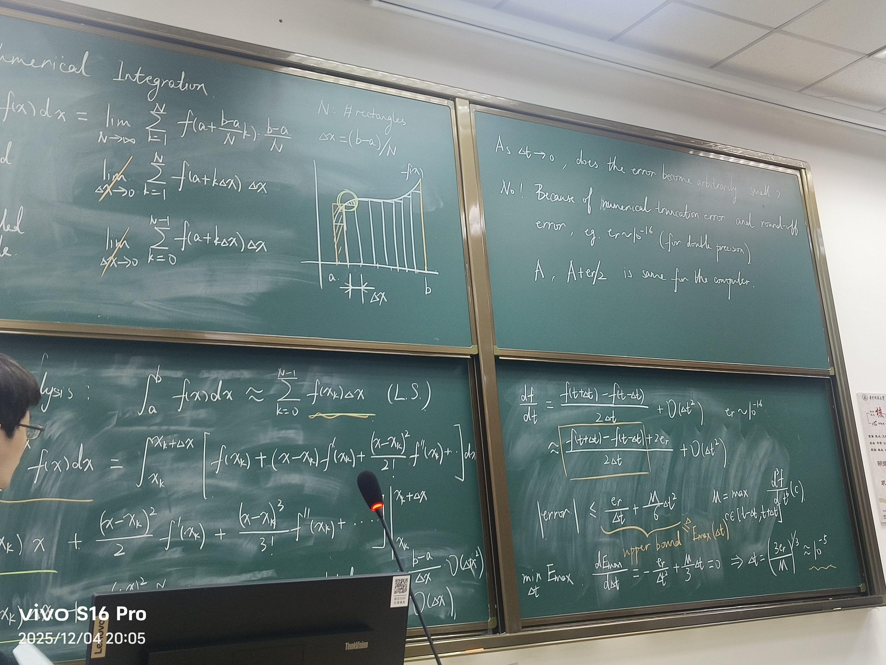

# Lecture 7 
## Coding
### 求一个已知函数的泰勒展开式
在matlab中，多项式需要的是各项的系数，用P的向量表示，从高次到低次（最低到常数项），然后用polyval(P,x)函数表示这个多项式。
求阶乘用factorial函数。
> ```matlab
> P = [1/factorial(5) 0 -1/factorial(3) 0 1 0];   
> yT3 = polyval(P , x);
> ```
完整代码：
```matlab
clear all;close all

x = -10:.1:10;
y = sin(x);

plot(x,y,'k','linewidth',2)
axis([-10,10,-10,10])
grid on;hold on

%多项式表达：从高到低，写系数
P = [1 0];   %y=x+0
yT1 = polyval(P , x);
plot(x,yT1,'b--','linewidth',2)

%阶乘函数：factorial(x)
P = [-1/factorial(3) 0 1 0];   
yT2 = polyval(P , x);
plot(x,yT1,'r--','linewidth',2)

P = [1/factorial(5) 0 -1/factorial(3) 0 1 0];   
yT3 = polyval(P , x);
plot(x,yT1,'g--','linewidth',2)
```

### 三种差分方法
按定义即可。
```matlab
clear all;close all

dt = 0.1;
t = -2 : dt : 4;
f = sin(t);
%导数真值
real_dfdt = cos(t);

%Forward
dfdt1 = (sin(t+dt)-sin(t))/dt;

%Backward
dfdt2 = (sin(t)-sin(t-dt))/dt;

%Central
dfdt3 = (sin(t+dt)-sin(t-dt))/(2*dt);

plot(t,real_dfdt,'k','linewidth',2)
%hold on:在一张图上画,加hold off停止；grid on:画网格
hold on;grid on

plot(t,dfdt1,'b','linewidth',2)
plot(t,dfdt2,'g','linewidth',2)
plot(t,dfdt3,'r','linewidth',2)
```

### 数列拟合的函数的差分计算
```matlab
clear all;close all

x = .1 : .1 : 3 ;

f = sin(x);

plot(x ,f , 'k')

hold on
%维数length(x)
n = length(f);

%需要安装符号计算工具箱
dfdx = zeros(n,1);

dfdx(1) = (f(2)-f(1))/(x(2)-x(1));

for k = 2: n-1
    dfdx(k) = (f(k+1)-f(k-1))/(x(k+1)-x(k-1));
end

dfdx(n) = (f(n)-f(n-1))/(x(n)-x(n-1));


figure
plot(x,cos(x),'k')
hold on
plot(x,dfdx,'r')
```

循环可以替换为向量而简化。
```matlab
dfdx(2:n-1)=(f(3:n)-f(1:n-2))/(x(3:n)-x(1:n-2));
```

## 二阶导数的计算
泰勒展开式相加，有
$f(x+\Delta x)+f(x-\Delta x)=2f(x)+(\Delta x)^2f''(x)+O(x^4)$
即$\frac{f(x+\Delta x)+f(x-\Delta x)-2f(x)}{(\Delta x)^2}=f''(x)+O((\Delta x)^2)$，即为二阶导数的估计式

## 精度
如果$\Delta x\rightarrow 0$，结果就一定越好吗？答案是否定的。
误差1：截断误差（trancation error），也就是只计算有限项
误差2：精度误差（round-off error），因为计算机存储的数字有一定精度上限，比如$A,A+\frac{er}{2}$被看做是一样的。
例如中心差分$\frac{f(t+\Delta t)-f(t-\Delta t)}{2\Delta t}$，取$er~10^{-16}$，那么最大误差就是$2er$，故上式约等于
$\frac{f(t+\Delta t)-f(t-\Delta t)+2er}{2\Delta t}$，故误差
$|error|\leq\frac{er}{\Delta t}+\frac{M}{6}(\Delta t)^2$，而$M$是由中值定理得出的。
不等号右边就是误差的上界，求导可以求得它的最小值。
$\frac{dE_{max}}{d\Delta t}=-\frac{er}{(\Delta t)^2}+\frac{M}{3}\Delta t=0$，解得$\Delta t=(\frac{3er}{M})^{\frac{1}{3}}\approx 10^{-5}$
所以并不是越小越好。很多估计的最好的$\Delta t$都是在这个附近。

## 数值积分（Numerical Integration）
$\int_{a}^{b} f(x)\,dx=\lim\limits_{N\rightarrow \infty}\sum\limits_{k=1}^{N}f(a+\frac{b-a}{N} k)\frac{b-a}{N}$

右侧矩形积分（Right-sided rectangle）
$\sum\limits_{k=1}^{N}f(a+k\Delta x)\Delta x$

左侧矩形积分（Left-sided rectangle）
$\sum\limits_{k=0}^{N-1}f(a+k\Delta x)\Delta x$

## 误差分析

> 左侧矩形积分：$\int_{a}^{b} f(x)\,dx\approx \sum\limits_{k=0}^{N-1}f(a+k\Delta x)\Delta x$

采用泰勒展开估计：

$\int_{x_k}^{x_k+\Delta x} f(x)\,dx=\int_{x_k}^{x_k+\Delta x} [f(x_k+(x-x_k)f'(x_k)+\frac{(x-x_k)^2}{2!}f''(x_k)+...]\,dx
=f(x_k)\Delta x+\frac{(x-x_k)^2}{2}+f'(x_k)\frac{(x-x_k)^3}{3!}f''(x_k)+...=f(x_k)\Delta x+\frac{(\Delta x)^2}{2!}f'(x_k)+...$
