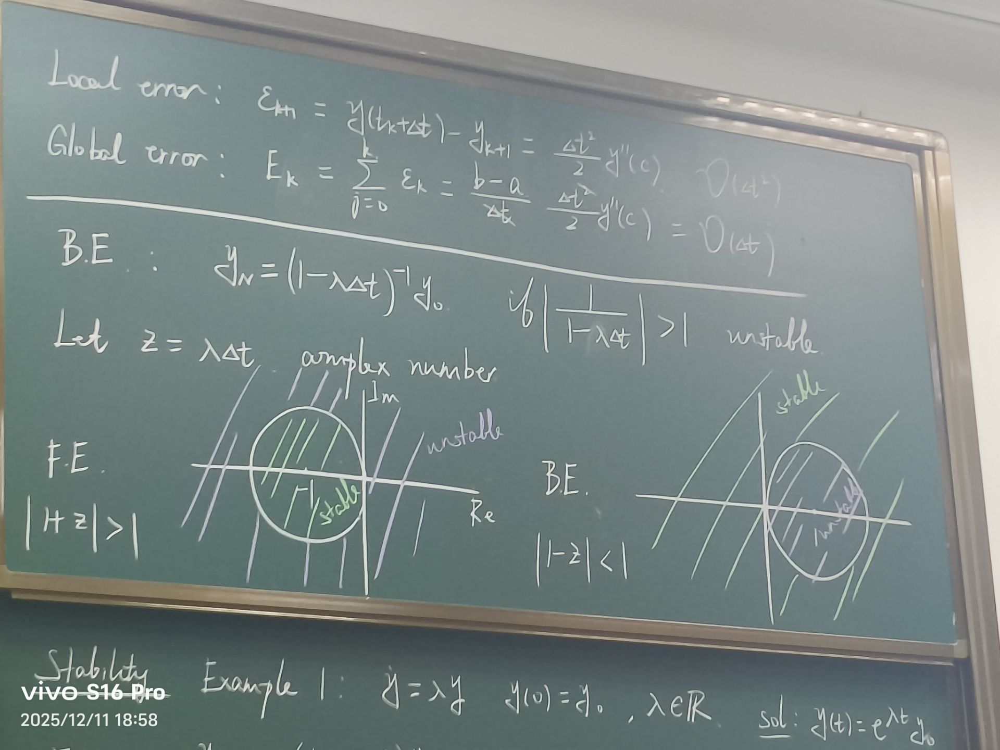

# Lecture 9
* 算法的精度？
* 如何理解复杂度？
## Error Analysis
> Forward Euler:$(y_{k+1}=y_k+\Delta t f(y_k))\approx (y(t_{k+1})=y(t_k+\Delta t))$

利用泰勒展开：
$y(t_k+\Delta t)=y(t_k)+\Delta t\frac{dy}{dt}(t_k)+\frac{\Delta t^2}{2!}\frac{d^2 y}{dt^2}(c),c\in[t_k,t_{k+1}]$
假设$y_k$完美估计了$y(t_k)$，也就是不考虑累积的影响，则有
$Error=y_k+\Delta t f(y_k)$，量级为$O(\Delta t^2)$
于是称$Local\,error:\epsilon_{k+1}=y(t_k+\Delta t)-y_{k+1}=\frac{\Delta t^2}{2}y''(c)$
$Global\,error:E_k=\sum\limits_{j=0}^{k}\epsilon_k=(b-a)\frac{\Delta t}{2}y''(c)$，但是量级$O(\Delta t)$
## Stability
### Example 1
$y'=\lambda y,y(0)=y_0,\lambda\in R$
$solution:y(t)=e^{\lambda t}y_0$
> $F.E.:y_{k+1}=(1+\lambda\Delta t)y_k$
> $B.E.:y_{k+1}=(1-\lambda \Delta t)^{-1}y_k$

于是从$y_0\rightarrow y_1\rightarrow y_2\rightarrow...\rightarrow y_N$有$y_N=(1+\lambda \Delta t )^N y_0$
假设初始出现了噪声，则有$round-off\,error:y_N=(1+\lambda \Delta t)^N(y_0+\delta)$
而$(E_N)^\delta=(1+\lambda \Delta t)^N\delta$
$if|1+\lambda \Delta t|>1$，则误差发散（指数爆炸）
相应地，$B.E.$中$y_N=(1+\lambda \Delta t )^{-N} y_0$
$if|\frac{1}{1+\lambda \Delta t}|>1$，则误差发散
### Example 2
$y'=Ay,y(0)=y_0,Exact\,solution:y(t)=e^{At}y_0$
> $F.E.:y_{k+1}=(1+\lambda\Delta t)y_k$
> $B.E.:y_{k+1}=(1-\lambda \Delta t)^{-1}y_k$

根据$F.E.$分析的结果是$y_N=(1+\Delta t A)^N y_0$
也就是$\forall|eig(I+\Delta t A)|<1$
根据$B.E.$分析的结果是$y_N=(1+\Delta t A)^{-N} y_0$
也就是$\forall|eig(I-\Delta t A)^{-1}|<1$

## 更复杂的方程：$y'=f(t,y)$
> $F.E:x_{k+1}=x_k+\Delta t f(x_k,y_k)$
> $B.E.:x_{k+1}=x_k+\Delta t f(x_{k+1},t_{k+1})$

* Generic integrator:$y_{k+1}=y_k+\Delta t \phi$
* We choose $\phi$ to reduce error
* **Idea**:Instead of $phi$ being the slope at $(t_k,y_k)(F.E.)$,or $(t_{k+1},y_{k+1})(B.E.)$,use the slope at$(t_k,y_k)$ and at **another** point $(t_k+P\Delta t,y_k+Q\Delta t f(t_k,y_k))$
$y_{k+1}=y_k+\Delta t[Af(t_k,y_k)+Bf(t_k+P\Delta t,y_k+Q\Delta t f(t_k,y_k))]$
We get to choose A,B,P,Q to match Taylor series $y(t_k+\Delta t)$ $if P=Q,then(t_k+P\Delta t,y_k+P\Delta t f(t_k,y_k))$is a small $P\Delta t\,F.E.$ step.
### Calculation
$f(Af(t_k,y_k)+Bf(t_k+P\Delta t,y_k+P\Delta t f(t_k,y_k)))=f(y_k,t_k)+P\Delta t\frac{\partial f}{\partial t}(t_k,y_k)+P\Delta t\frac{\partial f}{\partial y}(t_k,y_k)f(t_k,y_k)+O(\Delta t^2)$
代入上述方程有$y_{k+1}=y_k+\Delta t(A+B)f(t_k,y_k)+PB\Delta t^2 f_t(t_k,y_k)f(t_k,y_k)+O(\Delta t^3)$
与原式的泰勒展开比较：
$y(t_k+\Delta t)=y(t_k)+\Delta t\frac{dy}{dt}(t_k)+\frac{\Delta t^2}{2!}\frac{d^2 y}{dt^2}(t_k)+O(\Delta t^3)=y_k+\Delta t\frac{dy}{dt}(t_k,y_k)+\frac{\Delta t^2}{2!}\frac{d}{dt}f(t_k,y_k)+O(\Delta t^3)$
由链式法则有$y_k+\Delta t\frac{dy}{dt}(t_k,y_k)+\frac{\Delta t^2}{2!}[f_t(t_k,y_k)+f_y(t_k,y_k)f(y_k,y_k)]+O(\Delta t^3$)
运用待定系数法有
* $A+B=1$
* $PB=\frac{1}{2}$
* $P=Q$
这个方程组有无穷个解，最常用的是$A=0,B=1,P=\frac{1}{2}$
故$y_{k+1}=y_k+\Delta t f(t_k+\frac{\Delta t}{2},y_k+\frac{\Delta t}{2}f(t_k,y_k))$
称为**Second-order Runge-Kutta**
> 在matlab中为'ode23'函数

> 'Forth-order Runge-Kutta'('ode45')
> $y_{k+1}=y_k+\frac{\Delta t}{6}[f_1+2f_2+2f_3+f_4]$
> $where\,f_1=f(t_k,y_k)$
> $f_2=f(t_k+\frac{\Delta t}{2},y_k+\frac{\Delta t}{2})f_1$
> $f_3=f(t_k+\frac{\Delta t}{2},y_k+\frac{\Delta t}{2}f_2)$
> $f_4=f(t_k+\Delta t,y_k+\frac{\Delta t}{2}f_3)$